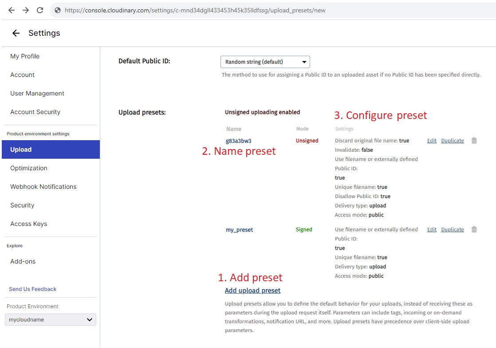

<div align="center" style="color:black">

<h1 align="center" style="color:black">
<a href="https://shop.josetolentino.site/" style="color:black">

<br>SHOP
</a>
</h1>

<h3>
<a href="https://shop.josetolentino.site/" rel="nofollow" style="color:black;">
For Vendors & Customers<br>
Vendors/Admin Dashboard is available<br>
Comes with a mobile app compatible with Android & iOS devices
</a>
</h3>


<p align="center">


</p>


</div>
<p style="color:blue">Make this text blue.</p>
---

https://github.com/jatolentino/Shop-Ecommerce/assets/61167951/1c848440-cbfb-4cc1-8823-18bfabe224d7

---

## 📖 Table of Contents
- [📖 Table of Contents](#-table-of-contents)
- [📍 Overview](#-overview)
- [📦 Features](#-features)
- [📂 repository Structure](#-repository-structure)
- [⚙️ Modules](#modules)
- [🚀 Getting Started](#-getting-started)
    - [🔧 Installation](#-installation)
      - [🌐 Local Installation](#-local-installation)
      - [💻 Web Deploy](#-web-installation)
    - [🤖 Running Shop-Ecommerce](#-running-Shop-Ecommerce)
    - [🧪 Tests](#-tests)
- [🛣 Roadmap](#-roadmap)
- [🤝 Contributing](#-contributing)
- [📄 License](#-license)
- [👏 Acknowledgments](#-acknowledgments)

---


## 📍 Overview

HTTPStatus Exception: 429

---

## 📦 Features

HTTPStatus Exception: 429

---


## 📂 Repository Structure

```sh
└── Shop-Ecommerce/
    ├── client/
    │   ├── package.json
    │   ├── public/
    │   │   ├── index.html
    │   │   ├── manifest.json
    │   │   └── robots.txt
    │   └── src/
    │       ├── App.js
    │       ├── App.test.js
    │       ├── components/
    │       ├── contexts/
    │       ├── datatablesource.js
    │       ├── formSource.js
    │       ├── index.css
    │       ├── index.js
    │       ├── index.test.css
    │       ├── pages/
    │       ├── redux/
    │       └── setupTests.js
    ├── server/
    │   ├── index.js
    │   ├── package.json
    │   ├── src/
    │   │   ├── config/
    │   │   ├── controllers/
    │   │   ├── helpers/
    │   │   ├── middlewares/
    │   │   ├── models/
    │   │   ├── routings/
    │   │   └── utils/
    │   └── vercel.json
    └── vercel.json

```

---


## ⚙️ Modules

<details closed><summary>Root</summary>

| File                                                                               | Summary                                                                                                                                                                                                                                                                                                                                                                                                                                                                                                                                                                                                          |
| ---                                                                                | ---                                                                                                                                                                                                                                                                                                                                                                                                                                                                                                                                                                                                              |
| [vercel.json](https://github.com/jatolentino/Shop-Ecommerce/blob/main/vercel.json) | The code above represents the directory tree structure for a Shop Ecommerce project. It consists of a client folder, containing various files related to the frontend, and a server folder, containing files related to the backend. The code in the file vercel.json specifies the build and deployment configurations for the project on the Vercel platform. It specifies that the source for building the project is the client/package.json file and the build command to be used is "@vercel/node". It also defines a route that maps any request starting with "client/" to the client/src/index.js file. |

</details>

<details closed><summary>Client</summary>

| File                                                                                        | Summary                                                                                                                                                                                                                                                                                                                                                                                                                                                                       |
| ---                                                                                         | ---                                                                                                                                                                                                                                                                                                                                                                                                                                                                           |
| [package.json](https://github.com/jatolentino/Shop-Ecommerce/blob/main/client/package.json) | The code represents a directory structure for a Shop-Ecommerce project. It consists of a "client" directory and a "server" directory. The "client" directory contains a package.json file which defines the project dependencies, scripts, and configurations. The dependencies include various libraries and frameworks like React, Redux, MUI, Axios, and others. The "server" directory contains the server-side code, including controllers, models, routes, and helpers. |

</details>

<details closed><summary>Src</summary>

| File                                                                                                        | Summary                                                                                                                                                                                                                                                                                                                                                                                                                            |
| ---                                                                                                         | ---                                                                                                                                                                                                                                                                                                                                                                                                                                |
| [index.js](https://github.com/jatolentino/Shop-Ecommerce/blob/main/client/src/index.js)                     | This code renders the main application component (`App.js`) on the client-side using React and ReactDOM. It also sets up the Redux store and provides it to the application using `Provider`. Additionally, it wraps the entire application in a `DarkModeContextProvider` component. CSS files are imported for styling, and the rendered application is mounted to the HTML element with the ID "root" in the `index.html` file. |
| [index.test.css](https://github.com/jatolentino/Shop-Ecommerce/blob/main/client/src/index.test.css)         | HTTPStatus Exception: 429                                                                                                                                                                                                                                                                                                                                                                                                          |
| [App.test.js](https://github.com/jatolentino/Shop-Ecommerce/blob/main/client/src/App.test.js)               | HTTPStatus Exception: 429                                                                                                                                                                                                                                                                                                                                                                                                          |
| [formSource.js](https://github.com/jatolentino/Shop-Ecommerce/blob/main/client/src/formSource.js)           | HTTPStatus Exception: 429                                                                                                                                                                                                                                                                                                                                                                                                          |
| [setupTests.js](https://github.com/jatolentino/Shop-Ecommerce/blob/main/client/src/setupTests.js)           | HTTPStatus Exception: 429                                                                                                                                                                                                                                                                                                                                                                                                          |
| [datatablesource.js](https://github.com/jatolentino/Shop-Ecommerce/blob/main/client/src/datatablesource.js) | HTTPStatus Exception: 429                                                                                                                                                                                                                                                                                                                                                                                                          |
| [App.js](https://github.com/jatolentino/Shop-Ecommerce/blob/main/client/src/App.js)                         | HTTPStatus Exception: 429                                                                                                                                                                                                                                                                                                                                                                                                          |
| [index.css](https://github.com/jatolentino/Shop-Ecommerce/blob/main/client/src/index.css)                   | HTTPStatus Exception: 429                                                                                                                                                                                                                                                                                                                                                                                                          |

</details>

<details closed><summary>Contexts</summary>

| File                                                                                                                 | Summary                   |
| ---                                                                                                                  | ---                       |
| [cart-context.js](https://github.com/jatolentino/Shop-Ecommerce/blob/main/client/src/contexts/cart-context.js)       | HTTPStatus Exception: 429 |
| [auth-context.js](https://github.com/jatolentino/Shop-Ecommerce/blob/main/client/src/contexts/auth-context.js)       | HTTPStatus Exception: 429 |
| [darkModeReducer.js](https://github.com/jatolentino/Shop-Ecommerce/blob/main/client/src/contexts/darkModeReducer.js) | HTTPStatus Exception: 429 |
| [darkModeContext.js](https://github.com/jatolentino/Shop-Ecommerce/blob/main/client/src/contexts/darkModeContext.js) | HTTPStatus Exception: 429 |
| [constants.js](https://github.com/jatolentino/Shop-Ecommerce/blob/main/client/src/contexts/constants.js)             | HTTPStatus Exception: 429 |

</details>

<details closed><summary>Blog</summary>

| File                                                                                                                                | Summary                   |
| ---                                                                                                                                 | ---                       |
| [BlogListViewArea.jsx](https://github.com/jatolentino/Shop-Ecommerce/blob/main/client/src/components/Blog/BlogListViewArea.jsx)     | HTTPStatus Exception: 429 |
| [BlogDetailsArea.jsx](https://github.com/jatolentino/Shop-Ecommerce/blob/main/client/src/components/Blog/BlogDetailsArea.jsx)       | HTTPStatus Exception: 429 |
| [BlogArea.jsx](https://github.com/jatolentino/Shop-Ecommerce/blob/main/client/src/components/Blog/BlogArea.jsx)                     | HTTPStatus Exception: 429 |
| [BlogLeftSidbarArea.jsx](https://github.com/jatolentino/Shop-Ecommerce/blob/main/client/src/components/Blog/BlogLeftSidbarArea.jsx) | HTTPStatus Exception: 429 |
| [BlogDetailsb.jsx](https://github.com/jatolentino/Shop-Ecommerce/blob/main/client/src/pages/Blog/BlogDetailsb.jsx)                  | HTTPStatus Exception: 429 |
| [BlogDetails.jsx](https://github.com/jatolentino/Shop-Ecommerce/blob/main/client/src/pages/Blog/BlogDetails.jsx)                    | HTTPStatus Exception: 429 |
| [BlogDetailsa.jsx](https://github.com/jatolentino/Shop-Ecommerce/blob/main/client/src/pages/Blog/BlogDetailsa.jsx)                  | HTTPStatus Exception: 429 |
| [BlogListView.jsx](https://github.com/jatolentino/Shop-Ecommerce/blob/main/client/src/pages/Blog/BlogListView.jsx)                  | HTTPStatus Exception: 429 |
| [BlogFullWidth.jsx](https://github.com/jatolentino/Shop-Ecommerce/blob/main/client/src/pages/Blog/BlogFullWidth.jsx)                | HTTPStatus Exception: 429 |
| [BlogLeftSidebar.jsx](https://github.com/jatolentino/Shop-Ecommerce/blob/main/client/src/pages/Blog/BlogLeftSidebar.jsx)            | HTTPStatus Exception: 429 |
| [BlogDetailsc.jsx](https://github.com/jatolentino/Shop-Ecommerce/blob/main/client/src/pages/Blog/BlogDetailsc.jsx)                  | HTTPStatus Exception: 429 |
| [Blog.jsx](https://github.com/jatolentino/Shop-Ecommerce/blob/main/client/src/pages/Blog/Blog.jsx)                                  | HTTPStatus Exception: 429 |
| [BlogRightSidebar.jsx](https://github.com/jatolentino/Shop-Ecommerce/blob/main/client/src/pages/Blog/BlogRightSidebar.jsx)          | HTTPStatus Exception: 429 |

</details>

<details closed><summary>__blogs__</summary>

| File                                                                                                                | Summary                   |
| ---                                                                                                                 | ---                       |
| [Blogs.jsx](https://github.com/jatolentino/Shop-Ecommerce/blob/main/client/src/components/Blog/__blogs__/Blogs.jsx) | HTTPStatus Exception: 429 |

</details>

<details closed><summary>Common</summary>

| File                                                                                                                            | Summary                   |
| ---                                                                                                                             | ---                       |
| [BestSellers.jsx](https://github.com/jatolentino/Shop-Ecommerce/blob/main/client/src/components/Common/BestSellers.jsx)         | HTTPStatus Exception: 429 |
| [Testimonial.jsx](https://github.com/jatolentino/Shop-Ecommerce/blob/main/client/src/components/Common/Testimonial.jsx)         | HTTPStatus Exception: 429 |
| [PageTitle.jsx](https://github.com/jatolentino/Shop-Ecommerce/blob/main/client/src/components/Common/PageTitle.jsx)             | HTTPStatus Exception: 429 |
| [SpecialProducts.jsx](https://github.com/jatolentino/Shop-Ecommerce/blob/main/client/src/components/Common/SpecialProducts.jsx) | HTTPStatus Exception: 429 |
| [NewArrivals.jsx](https://github.com/jatolentino/Shop-Ecommerce/blob/main/client/src/components/Common/NewArrivals.jsx)         | HTTPStatus Exception: 429 |
| [SupportTwo.jsx](https://github.com/jatolentino/Shop-Ecommerce/blob/main/client/src/components/Common/SupportTwo.jsx)           | HTTPStatus Exception: 429 |
| [SpecialOffer.jsx](https://github.com/jatolentino/Shop-Ecommerce/blob/main/client/src/components/Common/SpecialOffer.jsx)       | HTTPStatus Exception: 429 |
| [Collection.jsx](https://github.com/jatolentino/Shop-Ecommerce/blob/main/client/src/components/Common/Collection.jsx)           | HTTPStatus Exception: 429 |
| [LatestNews.jsx](https://github.com/jatolentino/Shop-Ecommerce/blob/main/client/src/components/Common/LatestNews.jsx)           | HTTPStatus Exception: 429 |
| [Support.jsx](https://github.com/jatolentino/Shop-Ecommerce/blob/main/client/src/components/Common/Support.jsx)                 | HTTPStatus Exception: 429 |
| [PageTitleVendor.jsx](https://github.com/jatolentino/Shop-Ecommerce/blob/main/client/src/components/Common/PageTitleVendor.jsx) | HTTPStatus Exception: 429 |
| [Partner.jsx](https://github.com/jatolentino/Shop-Ecommerce/blob/main/client/src/components/Common/Partner.jsx)                 | HTTPStatus Exception: 429 |
| [Preloader.jsx](https://github.com/jatolentino/Shop-Ecommerce/blob/main/client/src/components/Common/Preloader.jsx)             | HTTPStatus Exception: 429 |

</details>

<details closed><summary>Products</summary>

| File                                                                                                                                       | Summary                   |
| ---                                                                                                                                        | ---                       |
| [QuickView.css](https://github.com/jatolentino/Shop-Ecommerce/blob/main/client/src/components/Products/QuickView.css)                      | HTTPStatus Exception: 429 |
| [ProductsArea.jsx](https://github.com/jatolentino/Shop-Ecommerce/blob/main/client/src/components/Products/ProductsArea.jsx)                | HTTPStatus Exception: 429 |
| [QuickView.jsx](https://github.com/jatolentino/Shop-Ecommerce/blob/main/client/src/components/Products/QuickView.jsx)                      | HTTPStatus Exception: 429 |
| [AddProductArea.jsx](https://github.com/jatolentino/Shop-Ecommerce/blob/main/client/src/components/Products/AddProductArea.jsx)            | HTTPStatus Exception: 429 |
| [validateinfo.js](https://github.com/jatolentino/Shop-Ecommerce/blob/main/client/src/components/Products/validateinfo.js)                  | HTTPStatus Exception: 429 |
| [Products.jsx](https://github.com/jatolentino/Shop-Ecommerce/blob/main/client/src/pages/Products/Products.jsx)                             | HTTPStatus Exception: 429 |
| [AddProduct.jsx](https://github.com/jatolentino/Shop-Ecommerce/blob/main/client/src/pages/Products/AddProduct.jsx)                         | HTTPStatus Exception: 429 |
| [test.jsx](https://github.com/jatolentino/Shop-Ecommerce/blob/main/client/src/pages/Ecommerce/products/test.jsx)                           | HTTPStatus Exception: 429 |
| [productform.test.js](https://github.com/jatolentino/Shop-Ecommerce/blob/main/client/src/pages/Ecommerce/products/productform.test.js)     | HTTPStatus Exception: 429 |
| [productform.test.jsx](https://github.com/jatolentino/Shop-Ecommerce/blob/main/client/src/pages/Ecommerce/products/productform.test.jsx)   | HTTPStatus Exception: 429 |
| [AddProducts.jsx](https://github.com/jatolentino/Shop-Ecommerce/blob/main/client/src/pages/Ecommerce/products/AddProducts.jsx)             | HTTPStatus Exception: 429 |
| [addproducts.scss](https://github.com/jatolentino/Shop-Ecommerce/blob/main/client/src/pages/Ecommerce/products/addproducts.scss)           | HTTPStatus Exception: 429 |
| [ProductForm.jsx](https://github.com/jatolentino/Shop-Ecommerce/blob/main/client/src/pages/Ecommerce/products/ProductForm.jsx)             | HTTPStatus Exception: 429 |
| [productform1.test.jsx](https://github.com/jatolentino/Shop-Ecommerce/blob/main/client/src/pages/Ecommerce/products/productform1.test.jsx) | HTTPStatus Exception: 429 |
| [productform.scss](https://github.com/jatolentino/Shop-Ecommerce/blob/main/client/src/pages/Ecommerce/products/productform.scss)           | HTTPStatus Exception: 429 |
| [ListOfProducts.jsx](https://github.com/jatolentino/Shop-Ecommerce/blob/main/client/src/pages/Ecommerce/products/ListOfProducts.jsx)       | HTTPStatus Exception: 429 |
| [listofproducts.scss](https://github.com/jatolentino/Shop-Ecommerce/blob/main/client/src/pages/Ecommerce/products/listofproducts.scss)     | HTTPStatus Exception: 429 |

</details>

<details closed><summary>About</summary>

| File                                                                                                                                 | Summary                   |
| ---                                                                                                                                  | ---                       |
| [Founders.jsx](https://github.com/jatolentino/Shop-Ecommerce/blob/main/client/src/components/About/Founders.jsx)                     | HTTPStatus Exception: 429 |
| [VisionArea.jsx](https://github.com/jatolentino/Shop-Ecommerce/blob/main/client/src/components/About/VisionArea.jsx)                 | HTTPStatus Exception: 429 |
| [TeamMembers.jsx](https://github.com/jatolentino/Shop-Ecommerce/blob/main/client/src/components/About/TeamMembers.jsx)               | HTTPStatus Exception: 429 |
| [PrivacyPolicyArea.jsx](https://github.com/jatolentino/Shop-Ecommerce/blob/main/client/src/components/About/PrivacyPolicyArea.jsx)   | HTTPStatus Exception: 429 |
| [Map.jsx](https://github.com/jatolentino/Shop-Ecommerce/blob/main/client/src/components/About/Map.jsx)                               | HTTPStatus Exception: 429 |
| [FaqsArea.jsx](https://github.com/jatolentino/Shop-Ecommerce/blob/main/client/src/components/About/FaqsArea.jsx)                     | HTTPStatus Exception: 429 |
| [TrackingOrderArea.jsx](https://github.com/jatolentino/Shop-Ecommerce/blob/main/client/src/components/About/TrackingOrderArea.jsx)   | HTTPStatus Exception: 429 |
| [MissionArea.jsx](https://github.com/jatolentino/Shop-Ecommerce/blob/main/client/src/components/About/MissionArea.jsx)               | HTTPStatus Exception: 429 |
| [TermsOfServiceArea.jsx](https://github.com/jatolentino/Shop-Ecommerce/blob/main/client/src/components/About/TermsOfServiceArea.jsx) | HTTPStatus Exception: 429 |
| [FunFactArea.jsx](https://github.com/jatolentino/Shop-Ecommerce/blob/main/client/src/components/About/FunFactArea.jsx)               | HTTPStatus Exception: 429 |
| [CompareArea.jsx](https://github.com/jatolentino/Shop-Ecommerce/blob/main/client/src/components/About/CompareArea.jsx)               | HTTPStatus Exception: 429 |
| [StoryArea.jsx](https://github.com/jatolentino/Shop-Ecommerce/blob/main/client/src/components/About/StoryArea.jsx)                   | HTTPStatus Exception: 429 |
| [Terms.jsx](https://github.com/jatolentino/Shop-Ecommerce/blob/main/client/src/components/About/Terms.jsx)                           | HTTPStatus Exception: 429 |
| [SearchArea.jsx](https://github.com/jatolentino/Shop-Ecommerce/blob/main/client/src/components/About/SearchArea.jsx)                 | HTTPStatus Exception: 429 |
| [ErrorArea.jsx](https://github.com/jatolentino/Shop-Ecommerce/blob/main/client/src/components/About/ErrorArea.jsx)                   | HTTPStatus Exception: 429 |
| [Privacy.jsx](https://github.com/jatolentino/Shop-Ecommerce/blob/main/client/src/components/About/Privacy.jsx)                       | HTTPStatus Exception: 429 |
| [PricingArea.jsx](https://github.com/jatolentino/Shop-Ecommerce/blob/main/client/src/components/About/PricingArea.jsx)               | HTTPStatus Exception: 429 |
| [ContactArea.jsx](https://github.com/jatolentino/Shop-Ecommerce/blob/main/client/src/components/About/ContactArea.jsx)               | HTTPStatus Exception: 429 |
| [ComingSoonArea.jsx](https://github.com/jatolentino/Shop-Ecommerce/blob/main/client/src/components/About/ComingSoonArea.jsx)         | HTTPStatus Exception: 429 |
| [Data.js](https://github.com/jatolentino/Shop-Ecommerce/blob/main/client/src/components/About/Data.js)                               | HTTPStatus Exception: 429 |
| [MyAccount.jsx](https://github.com/jatolentino/Shop-Ecommerce/blob/main/client/src/pages/About/MyAccount.jsx)                        | HTTPStatus Exception: 429 |
| [ComingSoon.jsx](https://github.com/jatolentino/Shop-Ecommerce/blob/main/client/src/pages/About/ComingSoon.jsx)                      | HTTPStatus Exception: 429 |
| [About.jsx](https://github.com/jatolentino/Shop-Ecommerce/blob/main/client/src/pages/About/About.jsx)                                | HTTPStatus Exception: 429 |
| [Error-404.jsx](https://github.com/jatolentino/Shop-Ecommerce/blob/main/client/src/pages/About/Error-404.jsx)                        | HTTPStatus Exception: 429 |
| [OurTeam.jsx](https://github.com/jatolentino/Shop-Ecommerce/blob/main/client/src/pages/About/OurTeam.jsx)                            | HTTPStatus Exception: 429 |
| [Compare.jsx](https://github.com/jatolentino/Shop-Ecommerce/blob/main/client/src/pages/About/Compare.jsx)                            | HTTPStatus Exception: 429 |
| [PricingPlans.jsx](https://github.com/jatolentino/Shop-Ecommerce/blob/main/client/src/pages/About/PricingPlans.jsx)                  | HTTPStatus Exception: 429 |
| [Faqs.jsx](https://github.com/jatolentino/Shop-Ecommerce/blob/main/client/src/pages/About/Faqs.jsx)                                  | HTTPStatus Exception: 429 |
| [PrivacyPolicy.jsx](https://github.com/jatolentino/Shop-Ecommerce/blob/main/client/src/pages/About/PrivacyPolicy.jsx)                | HTTPStatus Exception: 429 |
| [Contact.jsx](https://github.com/jatolentino/Shop-Ecommerce/blob/main/client/src/pages/About/Contact.jsx)                            | HTTPStatus Exception: 429 |
| [Search.jsx](https://github.com/jatolentino/Shop-Ecommerce/blob/main/client/src/pages/About/Search.jsx)                              | HTTPStatus Exception: 429 |
| [TermsOfService.jsx](https://github.com/jatolentino/Shop-Ecommerce/blob/main/client/src/pages/About/TermsOfService.jsx)              | HTTPStatus Exception: 429 |
| [TrackingOrder.jsx](https://github.com/jatolentino/Shop-Ecommerce/blob/main/client/src/pages/About/TrackingOrder.jsx)                | HTTPStatus Exception: 429 |

</details>

<details closed><summary>User</summary>

| File                                                                                                            | Summary                   |
| ---                                                                                                             | ---                       |
| [UserArea.jsx](https://github.com/jatolentino/Shop-Ecommerce/blob/main/client/src/components/User/UserArea.jsx) | HTTPStatus Exception: 429 |
| [User.jsx](https://github.com/jatolentino/Shop-Ecommerce/blob/main/client/src/pages/User/User.jsx)              | HTTPStatus Exception: 429 |

</details>

<details closed><summary>Auth</summary>

| File                                                                                                                              | Summary                   |
| ---                                                                                                                               | ---                       |
| [loginarea.scss](https://github.com/jatolentino/Shop-Ecommerce/blob/main/client/src/components/Auth/loginarea.scss)               | HTTPStatus Exception: 429 |
| [LoginAreaVendor.jsx](https://github.com/jatolentino/Shop-Ecommerce/blob/main/client/src/components/Auth/LoginAreaVendor.jsx)     | HTTPStatus Exception: 429 |
| [RegisterArea.jsx](https://github.com/jatolentino/Shop-Ecommerce/blob/main/client/src/components/Auth/RegisterArea.jsx)           | HTTPStatus Exception: 429 |
| [LoginArea.jsx](https://github.com/jatolentino/Shop-Ecommerce/blob/main/client/src/components/Auth/LoginArea.jsx)                 | HTTPStatus Exception: 429 |
| [LoginArea.test.jsx](https://github.com/jatolentino/Shop-Ecommerce/blob/main/client/src/components/Auth/LoginArea.test.jsx)       | HTTPStatus Exception: 429 |
| [PasswordResetArea.jsx](https://github.com/jatolentino/Shop-Ecommerce/blob/main/client/src/components/Auth/PasswordResetArea.jsx) | HTTPStatus Exception: 429 |

</details>

<details closed><summary>Home-one</summary>

| File                                                                                                                                   | Summary                   |
| ---                                                                                                                                    | ---                       |
| [SpecialProducts.jsx](https://github.com/jatolentino/Shop-Ecommerce/blob/main/client/src/components/Home/Home-one/SpecialProducts.jsx) | HTTPStatus Exception: 429 |
| [Overview.jsx](https://github.com/jatolentino/Shop-Ecommerce/blob/main/client/src/components/Home/Home-one/Overview.jsx)               | HTTPStatus Exception: 429 |
| [SpecialOffer.jsx](https://github.com/jatolentino/Shop-Ecommerce/blob/main/client/src/components/Home/Home-one/SpecialOffer.jsx)       | HTTPStatus Exception: 429 |
| [Banner.jsx](https://github.com/jatolentino/Shop-Ecommerce/blob/main/client/src/components/Home/Home-one/Banner.jsx)                   | HTTPStatus Exception: 429 |

</details>

<details closed><summary>Home-three</summary>

| File                                                                                                                                         | Summary                   |
| ---                                                                                                                                          | ---                       |
| [OfferProductsArea.jsx](https://github.com/jatolentino/Shop-Ecommerce/blob/main/client/src/components/Home/Home-three/OfferProductsArea.jsx) | HTTPStatus Exception: 429 |
| [Banner.jsx](https://github.com/jatolentino/Shop-Ecommerce/blob/main/client/src/components/Home/Home-three/Banner.jsx)                       | HTTPStatus Exception: 429 |
| [FeaturedArea.jsx](https://github.com/jatolentino/Shop-Ecommerce/blob/main/client/src/components/Home/Home-three/FeaturedArea.jsx)           | HTTPStatus Exception: 429 |
| [HotProductsArea.jsx](https://github.com/jatolentino/Shop-Ecommerce/blob/main/client/src/components/Home/Home-three/HotProductsArea.jsx)     | HTTPStatus Exception: 429 |

</details>

<details closed><summary>Home-four</summary>

| File                                                                                                                              | Summary                   |
| ---                                                                                                                               | ---                       |
| [Banner.jsx](https://github.com/jatolentino/Shop-Ecommerce/blob/main/client/src/components/Home/Home-four/Banner.jsx)             | HTTPStatus Exception: 429 |
| [FeaturedArea.jsx](https://github.com/jatolentino/Shop-Ecommerce/blob/main/client/src/components/Home/Home-four/FeaturedArea.jsx) | HTTPStatus Exception: 429 |

</details>

<details closed><summary>Home-two</summary>

| File                                                                                                                             | Summary                   |
| ---                                                                                                                              | ---                       |
| [Banner.jsx](https://github.com/jatolentino/Shop-Ecommerce/blob/main/client/src/components/Home/Home-two/Banner.jsx)             | HTTPStatus Exception: 429 |
| [FeaturedArea.jsx](https://github.com/jatolentino/Shop-Ecommerce/blob/main/client/src/components/Home/Home-two/FeaturedArea.jsx) | HTTPStatus Exception: 429 |
| [Category.jsx](https://github.com/jatolentino/Shop-Ecommerce/blob/main/client/src/components/Home/Home-two/Category.jsx)         | HTTPStatus Exception: 429 |

</details>

<details closed><summary>Shop</summary>

| File                                                                                                                                                | Summary                   |
| ---                                                                                                                                                 | ---                       |
| [WishListArea.jsx](https://github.com/jatolentino/Shop-Ecommerce/blob/main/client/src/components/Shop/WishListArea.jsx)                             | HTTPStatus Exception: 429 |
| [ShopFullWidthArea.jsx](https://github.com/jatolentino/Shop-Ecommerce/blob/main/client/src/components/Shop/ShopFullWidthArea.jsx)                   | HTTPStatus Exception: 429 |
| [ShopArea.jsx](https://github.com/jatolentino/Shop-Ecommerce/blob/main/client/src/components/Shop/ShopArea.jsx)                                     | HTTPStatus Exception: 429 |
| [ShopListViewArea.jsx](https://github.com/jatolentino/Shop-Ecommerce/blob/main/client/src/components/Shop/ShopListViewArea.jsx)                     | HTTPStatus Exception: 429 |
| [CartArea.jsx](https://github.com/jatolentino/Shop-Ecommerce/blob/main/client/src/components/Shop/CartArea.jsx)                                     | HTTPStatus Exception: 429 |
| [ProductsDetailsSidebarArea.jsx](https://github.com/jatolentino/Shop-Ecommerce/blob/main/client/src/components/Shop/ProductsDetailsSidebarArea.jsx) | HTTPStatus Exception: 429 |
| [ProductsDetailsArea.jsx](https://github.com/jatolentino/Shop-Ecommerce/blob/main/client/src/components/Shop/ProductsDetailsArea.jsx)               | HTTPStatus Exception: 429 |
| [checkoutarea.test.jsx](https://github.com/jatolentino/Shop-Ecommerce/blob/main/client/src/components/Shop/checkoutarea.test.jsx)                   | HTTPStatus Exception: 429 |
| [ShopLeftSidebarArea.jsx](https://github.com/jatolentino/Shop-Ecommerce/blob/main/client/src/components/Shop/ShopLeftSidebarArea.jsx)               | HTTPStatus Exception: 429 |
| [CheckoutArea.jsx](https://github.com/jatolentino/Shop-Ecommerce/blob/main/client/src/components/Shop/CheckoutArea.jsx)                             | HTTPStatus Exception: 429 |
| [OrderArea.jsx](https://github.com/jatolentino/Shop-Ecommerce/blob/main/client/src/components/Shop/OrderArea.jsx)                                   | HTTPStatus Exception: 429 |
| [ShopLeftSidebar.jsx](https://github.com/jatolentino/Shop-Ecommerce/blob/main/client/src/pages/Shop/ShopLeftSidebar.jsx)                            | HTTPStatus Exception: 429 |
| [Cart.jsx](https://github.com/jatolentino/Shop-Ecommerce/blob/main/client/src/pages/Shop/Cart.jsx)                                                  | HTTPStatus Exception: 429 |
| [WishList.jsx](https://github.com/jatolentino/Shop-Ecommerce/blob/main/client/src/pages/Shop/WishList.jsx)                                          | HTTPStatus Exception: 429 |
| [ShopListView.jsx](https://github.com/jatolentino/Shop-Ecommerce/blob/main/client/src/pages/Shop/ShopListView.jsx)                                  | HTTPStatus Exception: 429 |
| [ProductsDetails.jsx](https://github.com/jatolentino/Shop-Ecommerce/blob/main/client/src/pages/Shop/ProductsDetails.jsx)                            | HTTPStatus Exception: 429 |
| [Checkout.jsx](https://github.com/jatolentino/Shop-Ecommerce/blob/main/client/src/pages/Shop/Checkout.jsx)                                          | HTTPStatus Exception: 429 |
| [ShopRightSidebar.jsx](https://github.com/jatolentino/Shop-Ecommerce/blob/main/client/src/pages/Shop/ShopRightSidebar.jsx)                          | HTTPStatus Exception: 429 |
| [ShopFullWidth.jsx](https://github.com/jatolentino/Shop-Ecommerce/blob/main/client/src/pages/Shop/ShopFullWidth.jsx)                                | HTTPStatus Exception: 429 |
| [Shop.jsx](https://github.com/jatolentino/Shop-Ecommerce/blob/main/client/src/pages/Shop/Shop.jsx)                                                  | HTTPStatus Exception: 429 |
| [Orders.jsx](https://github.com/jatolentino/Shop-Ecommerce/blob/main/client/src/pages/Shop/Orders.jsx)                                              | HTTPStatus Exception: 429 |
| [ProductsDetailsSidebar.jsx](https://github.com/jatolentino/Shop-Ecommerce/blob/main/client/src/pages/Shop/ProductsDetailsSidebar.jsx)              | HTTPStatus Exception: 429 |

</details>

<details closed><summary>__payment__</summary>

| File                                                                                                                                  | Summary                   |
| ---                                                                                                                                   | ---                       |
| [payment.scss](https://github.com/jatolentino/Shop-Ecommerce/blob/main/client/src/components/Shop/__payment__/payment.scss)           | HTTPStatus Exception: 429 |
| [State.jsx](https://github.com/jatolentino/Shop-Ecommerce/blob/main/client/src/components/Shop/__payment__/State.jsx)                 | HTTPStatus Exception: 429 |
| [Payment.jsx](https://github.com/jatolentino/Shop-Ecommerce/blob/main/client/src/components/Shop/__payment__/Payment.jsx)             | HTTPStatus Exception: 429 |
| [payment.test.scss](https://github.com/jatolentino/Shop-Ecommerce/blob/main/client/src/components/Shop/__payment__/payment.test.scss) | HTTPStatus Exception: 429 |

</details>

<details closed><summary>Form</summary>

| File                                                                                                                               | Summary                   |
| ---                                                                                                                                | ---                       |
| [Form.jsx](https://github.com/jatolentino/Shop-Ecommerce/blob/main/client/src/components/Shop/__payment__/component/form/Form.jsx) | HTTPStatus Exception: 429 |

</details>

<details closed><summary>Card</summary>

| File                                                                                                                                           | Summary                   |
| ---                                                                                                                                            | ---                       |
| [Card.jsx](https://github.com/jatolentino/Shop-Ecommerce/blob/main/client/src/components/Shop/__payment__/component/card/Card.jsx)             | HTTPStatus Exception: 429 |
| [Card.test.jsx](https://github.com/jatolentino/Shop-Ecommerce/blob/main/client/src/components/Shop/__payment__/component/card/Card.test.jsx)   | HTTPStatus Exception: 429 |
| [card.scss](https://github.com/jatolentino/Shop-Ecommerce/blob/main/client/src/components/Shop/__payment__/component/card/card.scss)           | HTTPStatus Exception: 429 |
| [card1.test.jsx](https://github.com/jatolentino/Shop-Ecommerce/blob/main/client/src/components/Shop/__payment__/component/card/card1.test.jsx) | HTTPStatus Exception: 429 |

</details>

<details closed><summary>__products__</summary>

| File                                                                                                                                     | Summary                   |
| ---                                                                                                                                      | ---                       |
| [Products.jsx](https://github.com/jatolentino/Shop-Ecommerce/blob/main/client/src/components/Shop/__products__/Products.jsx)             | HTTPStatus Exception: 429 |
| [orderarea.test.jsx](https://github.com/jatolentino/Shop-Ecommerce/blob/main/client/src/components/Shop/__products__/orderarea.test.jsx) | HTTPStatus Exception: 429 |

</details>

<details closed><summary>Footer</summary>

| File                                                                                                          | Summary                   |
| ---                                                                                                           | ---                       |
| [Footer.jsx](https://github.com/jatolentino/Shop-Ecommerce/blob/main/client/src/components/Footer/Footer.jsx) | HTTPStatus Exception: 429 |

</details>

<details closed><summary>Widget</summary>

| File                                                                                                                      | Summary                   |
| ---                                                                                                                       | ---                       |
| [Widget.jsx](https://github.com/jatolentino/Shop-Ecommerce/blob/main/client/src/components/Ecommerce/Widget/Widget.jsx)   | HTTPStatus Exception: 429 |
| [widget.scss](https://github.com/jatolentino/Shop-Ecommerce/blob/main/client/src/components/Ecommerce/Widget/widget.scss) | HTTPStatus Exception: 429 |

</details>

<details closed><summary>Featured</summary>

| File                                                                                                                            | Summary                   |
| ---                                                                                                                             | ---                       |
| [featured.scss](https://github.com/jatolentino/Shop-Ecommerce/blob/main/client/src/components/Ecommerce/Featured/featured.scss) | HTTPStatus Exception: 429 |
| [Featured.jsx](https://github.com/jatolentino/Shop-Ecommerce/blob/main/client/src/components/Ecommerce/Featured/Featured.jsx)   | HTTPStatus Exception: 429 |

</details>

<details closed><summary>Table</summary>

| File                                                                                                                   | Summary                   |
| ---                                                                                                                    | ---                       |
| [Table.jsx](https://github.com/jatolentino/Shop-Ecommerce/blob/main/client/src/components/Ecommerce/Table/Table.jsx)   | HTTPStatus Exception: 429 |
| [table.scss](https://github.com/jatolentino/Shop-Ecommerce/blob/main/client/src/components/Ecommerce/Table/table.scss) | HTTPStatus Exception: 429 |

</details>

<details closed><summary>Navbar</summary>

| File                                                                                                                      | Summary                   |
| ---                                                                                                                       | ---                       |
| [navbar.scss](https://github.com/jatolentino/Shop-Ecommerce/blob/main/client/src/components/Ecommerce/Navbar/navbar.scss) | HTTPStatus Exception: 429 |
| [Navbar.jsx](https://github.com/jatolentino/Shop-Ecommerce/blob/main/client/src/components/Ecommerce/Navbar/Navbar.jsx)   | HTTPStatus Exception: 429 |

</details>

<details closed><summary>Sidebar</summary>

| File                                                                                                                                 | Summary                   |
| ---                                                                                                                                  | ---                       |
| [Sidebar.jsx](https://github.com/jatolentino/Shop-Ecommerce/blob/main/client/src/components/Ecommerce/Sidebar/Sidebar.jsx)           | HTTPStatus Exception: 429 |
| [Sidebar.test.jsx](https://github.com/jatolentino/Shop-Ecommerce/blob/main/client/src/components/Ecommerce/Sidebar/Sidebar.test.jsx) | HTTPStatus Exception: 429 |
| [sidebar.scss](https://github.com/jatolentino/Shop-Ecommerce/blob/main/client/src/components/Ecommerce/Sidebar/sidebar.scss)         | HTTPStatus Exception: 429 |

</details>

<details closed><summary>Productstable</summary>

| File                                                                                                                                                     | Summary                   |
| ---                                                                                                                                                      | ---                       |
| [Datatable1.test.jsx](https://github.com/jatolentino/Shop-Ecommerce/blob/main/client/src/components/Ecommerce/ProductsTable/Datatable1.test.jsx)         | HTTPStatus Exception: 429 |
| [productstable.scss](https://github.com/jatolentino/Shop-Ecommerce/blob/main/client/src/components/Ecommerce/ProductsTable/productstable.scss)           | HTTPStatus Exception: 429 |
| [Datatable2.test.jsx](https://github.com/jatolentino/Shop-Ecommerce/blob/main/client/src/components/Ecommerce/ProductsTable/Datatable2.test.jsx)         | HTTPStatus Exception: 429 |
| [Datatable3.test.jsx](https://github.com/jatolentino/Shop-Ecommerce/blob/main/client/src/components/Ecommerce/ProductsTable/Datatable3.test.jsx)         | HTTPStatus Exception: 429 |
| [ProductsTableSource.jsx](https://github.com/jatolentino/Shop-Ecommerce/blob/main/client/src/components/Ecommerce/ProductsTable/ProductsTableSource.jsx) | HTTPStatus Exception: 429 |
| [UserColumns.test.jsx](https://github.com/jatolentino/Shop-Ecommerce/blob/main/client/src/components/Ecommerce/ProductsTable/UserColumns.test.jsx)       | HTTPStatus Exception: 429 |
| [Datatable.test.jsx](https://github.com/jatolentino/Shop-Ecommerce/blob/main/client/src/components/Ecommerce/ProductsTable/Datatable.test.jsx)           | HTTPStatus Exception: 429 |
| [ProductsTable.jsx](https://github.com/jatolentino/Shop-Ecommerce/blob/main/client/src/components/Ecommerce/ProductsTable/ProductsTable.jsx)             | HTTPStatus Exception: 429 |

</details>

<details closed><summary>Vendorstable</summary>

| File                                                                                                                                                | Summary                   |
| ---                                                                                                                                                 | ---                       |
| [VendorsTable.jsx](https://github.com/jatolentino/Shop-Ecommerce/blob/main/client/src/components/Ecommerce/VendorsTable/VendorsTable.jsx)           | HTTPStatus Exception: 429 |
| [vendorstable.scss](https://github.com/jatolentino/Shop-Ecommerce/blob/main/client/src/components/Ecommerce/VendorsTable/vendorstable.scss)         | HTTPStatus Exception: 429 |
| [VendorTableSource.jsx](https://github.com/jatolentino/Shop-Ecommerce/blob/main/client/src/components/Ecommerce/VendorsTable/VendorTableSource.jsx) | HTTPStatus Exception: 429 |

</details>

<details closed><summary>Orderstable</summary>

| File                                                                                                                                     | Summary                   |
| ---                                                                                                                                      | ---                       |
| [orderstable.scss](https://github.com/jatolentino/Shop-Ecommerce/blob/main/client/src/components/Ecommerce/OrdersTable/orderstable.scss) | HTTPStatus Exception: 429 |
| [OrdersTable.jsx](https://github.com/jatolentino/Shop-Ecommerce/blob/main/client/src/components/Ecommerce/OrdersTable/OrdersTable.jsx)   | HTTPStatus Exception: 429 |

</details>

<details closed><summary>Chart</summary>

| File                                                                                                                   | Summary                   |
| ---                                                                                                                    | ---                       |
| [Chart.jsx](https://github.com/jatolentino/Shop-Ecommerce/blob/main/client/src/components/Ecommerce/Chart/Chart.jsx)   | HTTPStatus Exception: 429 |
| [chart.scss](https://github.com/jatolentino/Shop-Ecommerce/blob/main/client/src/components/Ecommerce/Chart/chart.scss) | HTTPStatus Exception: 429 |

</details>

<details closed><summary>Customerstable</summary>

| File                                                                                                                                                      | Summary                   |
| ---                                                                                                                                                       | ---                       |
| [CustomerTableSource.jsx](https://github.com/jatolentino/Shop-Ecommerce/blob/main/client/src/components/Ecommerce/CustomersTable/CustomerTableSource.jsx) | HTTPStatus Exception: 429 |
| [CustomersTable.jsx](https://github.com/jatolentino/Shop-Ecommerce/blob/main/client/src/components/Ecommerce/CustomersTable/CustomersTable.jsx)           | HTTPStatus Exception: 429 |
| [customerstable.scss](https://github.com/jatolentino/Shop-Ecommerce/blob/main/client/src/components/Ecommerce/CustomersTable/customerstable.scss)         | HTTPStatus Exception: 429 |

</details>

<details closed><summary>Shownavbar</summary>

| File                                                                                                                      | Summary                   |
| ---                                                                                                                       | ---                       |
| [ShowNavbar.jsx](https://github.com/jatolentino/Shop-Ecommerce/blob/main/client/src/components/ShowNavbar/ShowNavbar.jsx) | HTTPStatus Exception: 429 |

</details>

<details closed><summary>Widgets</summary>

| File                                                                                                                                   | Summary                   |
| ---                                                                                                                                    | ---                       |
| [PopularPosts.jsx](https://github.com/jatolentino/Shop-Ecommerce/blob/main/client/src/components/Widgets/PopularPosts.jsx)             | HTTPStatus Exception: 429 |
| [PopularTags.jsx](https://github.com/jatolentino/Shop-Ecommerce/blob/main/client/src/components/Widgets/PopularTags.jsx)               | HTTPStatus Exception: 429 |
| [Continents.jsx](https://github.com/jatolentino/Shop-Ecommerce/blob/main/client/src/components/Widgets/Continents.jsx)                 | HTTPStatus Exception: 429 |
| [Arrival.jsx](https://github.com/jatolentino/Shop-Ecommerce/blob/main/client/src/components/Widgets/Arrival.jsx)                       | HTTPStatus Exception: 429 |
| [Categories.jsx](https://github.com/jatolentino/Shop-Ecommerce/blob/main/client/src/components/Widgets/Categories.jsx)                 | HTTPStatus Exception: 429 |
| [BestSellerProducts.jsx](https://github.com/jatolentino/Shop-Ecommerce/blob/main/client/src/components/Widgets/BestSellerProducts.jsx) | HTTPStatus Exception: 429 |
| [Search.jsx](https://github.com/jatolentino/Shop-Ecommerce/blob/main/client/src/components/Widgets/Search.jsx)                         | HTTPStatus Exception: 429 |
| [Price.jsx](https://github.com/jatolentino/Shop-Ecommerce/blob/main/client/src/components/Widgets/Price.jsx)                           | HTTPStatus Exception: 429 |

</details>

<details closed><summary>Layout</summary>

| File                                                                                                                      | Summary                   |
| ---                                                                                                                       | ---                       |
| [MiddleHeader.css](https://github.com/jatolentino/Shop-Ecommerce/blob/main/client/src/components/Layout/MiddleHeader.css) | HTTPStatus Exception: 429 |
| [MiddleHeader.jsx](https://github.com/jatolentino/Shop-Ecommerce/blob/main/client/src/components/Layout/MiddleHeader.jsx) | HTTPStatus Exception: 429 |
| [Navbar.jsx](https://github.com/jatolentino/Shop-Ecommerce/blob/main/client/src/components/Layout/Navbar.jsx)             | HTTPStatus Exception: 429 |
| [TopHeader.jsx](https://github.com/jatolentino/Shop-Ecommerce/blob/main/client/src/components/Layout/TopHeader.jsx)       | HTTPStatus Exception: 429 |
| [TopHeader.css](https://github.com/jatolentino/Shop-Ecommerce/blob/main/client/src/components/Layout/TopHeader.css)       | HTTPStatus Exception: 429 |

</details>

<details closed><summary>Home</summary>

| File                                                                                                         | Summary                   |
| ---                                                                                                          | ---                       |
| [Home.css](https://github.com/jatolentino/Shop-Ecommerce/blob/main/client/src/pages/Home/Home.css)           | HTTPStatus Exception: 429 |
| [HomeFour.jsx](https://github.com/jatolentino/Shop-Ecommerce/blob/main/client/src/pages/Home/HomeFour.jsx)   | HTTPStatus Exception: 429 |
| [HomeTwo.jsx](https://github.com/jatolentino/Shop-Ecommerce/blob/main/client/src/pages/Home/HomeTwo.jsx)     | HTTPStatus Exception: 429 |
| [Home.jsx](https://github.com/jatolentino/Shop-Ecommerce/blob/main/client/src/pages/Home/Home.jsx)           | HTTPStatus Exception: 429 |
| [HomeThree.jsx](https://github.com/jatolentino/Shop-Ecommerce/blob/main/client/src/pages/Home/HomeThree.jsx) | HTTPStatus Exception: 429 |

</details>

<details closed><summary>Authentications</summary>

| File                                                                                                                                  | Summary                   |
| ---                                                                                                                                   | ---                       |
| [LoginVendor.test.jsx](https://github.com/jatolentino/Shop-Ecommerce/blob/main/client/src/pages/Authentications/LoginVendor.test.jsx) | HTTPStatus Exception: 429 |
| [ResetPassword.jsx](https://github.com/jatolentino/Shop-Ecommerce/blob/main/client/src/pages/Authentications/ResetPassword.jsx)       | HTTPStatus Exception: 429 |
| [Login.jsx](https://github.com/jatolentino/Shop-Ecommerce/blob/main/client/src/pages/Authentications/Login.jsx)                       | HTTPStatus Exception: 429 |
| [LoginVendor.jsx](https://github.com/jatolentino/Shop-Ecommerce/blob/main/client/src/pages/Authentications/LoginVendor.jsx)           | HTTPStatus Exception: 429 |
| [Register.jsx](https://github.com/jatolentino/Shop-Ecommerce/blob/main/client/src/pages/Authentications/Register.jsx)                 | HTTPStatus Exception: 429 |

</details>

<details closed><summary>Singlecustomer</summary>

| File                                                                                                                                         | Summary                   |
| ---                                                                                                                                          | ---                       |
| [singlecustomer.scss](https://github.com/jatolentino/Shop-Ecommerce/blob/main/client/src/pages/Ecommerce/singlecustomer/singlecustomer.scss) | HTTPStatus Exception: 429 |
| [SingleCustomer.jsx](https://github.com/jatolentino/Shop-Ecommerce/blob/main/client/src/pages/Ecommerce/singlecustomer/SingleCustomer.jsx)   | HTTPStatus Exception: 429 |

</details>

<details closed><summary>New</summary>

| File                                                                                                        | Summary                   |
| ---                                                                                                         | ---                       |
| [new.scss](https://github.com/jatolentino/Shop-Ecommerce/blob/main/client/src/pages/Ecommerce/new/new.scss) | HTTPStatus Exception: 429 |
| [New.jsx](https://github.com/jatolentino/Shop-Ecommerce/blob/main/client/src/pages/Ecommerce/new/New.jsx)   | HTTPStatus Exception: 429 |

</details>

<details closed><summary>Customers</summary>

| File                                                                                                                          | Summary                   |
| ---                                                                                                                           | ---                       |
| [Customers.jsx](https://github.com/jatolentino/Shop-Ecommerce/blob/main/client/src/pages/Ecommerce/customers/Customers.jsx)   | HTTPStatus Exception: 429 |
| [customers.scss](https://github.com/jatolentino/Shop-Ecommerce/blob/main/client/src/pages/Ecommerce/customers/customers.scss) | HTTPStatus Exception: 429 |

</details>

<details closed><summary>Dashboard</summary>

| File                                                                                                                          | Summary                   |
| ---                                                                                                                           | ---                       |
| [dashboard.scss](https://github.com/jatolentino/Shop-Ecommerce/blob/main/client/src/pages/Ecommerce/dashboard/dashboard.scss) | HTTPStatus Exception: 429 |
| [Dashboard.jsx](https://github.com/jatolentino/Shop-Ecommerce/blob/main/client/src/pages/Ecommerce/dashboard/Dashboard.jsx)   | HTTPStatus Exception: 429 |

</details>

<details closed><summary>Vendors</summary>

| File                                                                                                                    | Summary                   |
| ---                                                                                                                     | ---                       |
| [Vendors.jsx](https://github.com/jatolentino/Shop-Ecommerce/blob/main/client/src/pages/Ecommerce/vendors/Vendors.jsx)   | HTTPStatus Exception: 429 |
| [vendors.scss](https://github.com/jatolentino/Shop-Ecommerce/blob/main/client/src/pages/Ecommerce/vendors/vendors.scss) | HTTPStatus Exception: 429 |

</details>

<details closed><summary>Login</summary>

| File                                                                                                              | Summary                   |
| ---                                                                                                               | ---                       |
| [login.scss](https://github.com/jatolentino/Shop-Ecommerce/blob/main/client/src/pages/Ecommerce/login/login.scss) | HTTPStatus Exception: 429 |
| [Login.jsx](https://github.com/jatolentino/Shop-Ecommerce/blob/main/client/src/pages/Ecommerce/login/Login.jsx)   | HTTPStatus Exception: 429 |

</details>

<details closed><summary>Vendororders</summary>

| File                                                                                                                                   | Summary                   |
| ---                                                                                                                                    | ---                       |
| [VendorOrders.jsx](https://github.com/jatolentino/Shop-Ecommerce/blob/main/client/src/pages/Ecommerce/vendororders/VendorOrders.jsx)   | HTTPStatus Exception: 429 |
| [vendororders.scss](https://github.com/jatolentino/Shop-Ecommerce/blob/main/client/src/pages/Ecommerce/vendororders/vendororders.scss) | HTTPStatus Exception: 429 |

</details>

<details closed><summary>Singlevendor</summary>

| File                                                                                                                                   | Summary                   |
| ---                                                                                                                                    | ---                       |
| [SingleVendor.jsx](https://github.com/jatolentino/Shop-Ecommerce/blob/main/client/src/pages/Ecommerce/singlevendor/SingleVendor.jsx)   | HTTPStatus Exception: 429 |
| [singlevendor.scss](https://github.com/jatolentino/Shop-Ecommerce/blob/main/client/src/pages/Ecommerce/singlevendor/singlevendor.scss) | HTTPStatus Exception: 429 |

</details>

<details closed><summary>Redux</summary>

| File                                                                                                      | Summary                   |
| ---                                                                                                       | ---                       |
| [RootReducer.js](https://github.com/jatolentino/Shop-Ecommerce/blob/main/client/src/redux/RootReducer.js) | HTTPStatus Exception: 429 |
| [Store.js](https://github.com/jatolentino/Shop-Ecommerce/blob/main/client/src/redux/Store.js)             | HTTPStatus Exception: 429 |

</details>

<details closed><summary>Order</summary>

| File                                                                                                              | Summary                   |
| ---                                                                                                               | ---                       |
| [OrderTypes.js](https://github.com/jatolentino/Shop-Ecommerce/blob/main/client/src/redux/Order/OrderTypes.js)     | HTTPStatus Exception: 429 |
| [OrderAction.js](https://github.com/jatolentino/Shop-Ecommerce/blob/main/client/src/redux/Order/OrderAction.js)   | HTTPStatus Exception: 429 |
| [OrderReducer.js](https://github.com/jatolentino/Shop-Ecommerce/blob/main/client/src/redux/Order/OrderReducer.js) | HTTPStatus Exception: 429 |

</details>

<details closed><summary>Resetpassword</summary>

| File                                                                                                                            | Summary                   |
| ---                                                                                                                             | ---                       |
| [PasswordTypes.js](https://github.com/jatolentino/Shop-Ecommerce/blob/main/client/src/redux/ResetPassword/PasswordTypes.js)     | HTTPStatus Exception: 429 |
| [PasswordAction.js](https://github.com/jatolentino/Shop-Ecommerce/blob/main/client/src/redux/ResetPassword/PasswordAction.js)   | HTTPStatus Exception: 429 |
| [PasswordReducer.js](https://github.com/jatolentino/Shop-Ecommerce/blob/main/client/src/redux/ResetPassword/PasswordReducer.js) | HTTPStatus Exception: 429 |

</details>

<details closed><summary>Product</summary>

| File                                                                                                                    | Summary                   |
| ---                                                                                                                     | ---                       |
| [ProductAction.js](https://github.com/jatolentino/Shop-Ecommerce/blob/main/client/src/redux/Product/ProductAction.js)   | HTTPStatus Exception: 429 |
| [ProductReducer.js](https://github.com/jatolentino/Shop-Ecommerce/blob/main/client/src/redux/Product/ProductReducer.js) | HTTPStatus Exception: 429 |
| [ProductTypes.js](https://github.com/jatolentino/Shop-Ecommerce/blob/main/client/src/redux/Product/ProductTypes.js)     | HTTPStatus Exception: 429 |

</details>

<details closed><summary>Public</summary>

| File                                                                                                 | Summary                   |
| ---                                                                                                  | ---                       |
| [robots.txt](https://github.com/jatolentino/Shop-Ecommerce/blob/main/client/public/robots.txt)       | HTTPStatus Exception: 429 |
| [index.html](https://github.com/jatolentino/Shop-Ecommerce/blob/main/client/public/index.html)       | HTTPStatus Exception: 429 |
| [manifest.json](https://github.com/jatolentino/Shop-Ecommerce/blob/main/client/public/manifest.json) | HTTPStatus Exception: 429 |

</details>

<details closed><summary>Server</summary>

| File                                                                                        | Summary                   |
| ---                                                                                         | ---                       |
| [index.js](https://github.com/jatolentino/Shop-Ecommerce/blob/main/server/index.js)         | HTTPStatus Exception: 429 |
| [package.json](https://github.com/jatolentino/Shop-Ecommerce/blob/main/server/package.json) | HTTPStatus Exception: 429 |
| [vercel.json](https://github.com/jatolentino/Shop-Ecommerce/blob/main/server/vercel.json)   | HTTPStatus Exception: 429 |

</details>

<details closed><summary>Helpers</summary>

| File                                                                                                              | Summary                   |
| ---                                                                                                               | ---                       |
| [genAccessToken.js](https://github.com/jatolentino/Shop-Ecommerce/blob/main/server/src/helpers/genAccessToken.js) | HTTPStatus Exception: 429 |

</details>

<details closed><summary>Routings</summary>

| File                                                                                                 | Summary                   |
| ---                                                                                                  | ---                       |
| [product.js](https://github.com/jatolentino/Shop-Ecommerce/blob/main/server/src/routings/product.js) | HTTPStatus Exception: 429 |
| [user.js](https://github.com/jatolentino/Shop-Ecommerce/blob/main/server/src/routings/user.js)       | HTTPStatus Exception: 429 |
| [order.js](https://github.com/jatolentino/Shop-Ecommerce/blob/main/server/src/routings/order.js)     | HTTPStatus Exception: 429 |

</details>

<details closed><summary>Config</summary>

| File                                                                                     | Summary                   |
| ---                                                                                      | ---                       |
| [db.js](https://github.com/jatolentino/Shop-Ecommerce/blob/main/server/src/config/db.js) | HTTPStatus Exception: 429 |

</details>

<details closed><summary>Controllers</summary>

| File                                                                                                    | Summary                   |
| ---                                                                                                     | ---                       |
| [product.js](https://github.com/jatolentino/Shop-Ecommerce/blob/main/server/src/controllers/product.js) | HTTPStatus Exception: 429 |
| [user.js](https://github.com/jatolentino/Shop-Ecommerce/blob/main/server/src/controllers/user.js)       | HTTPStatus Exception: 429 |
| [order.js](https://github.com/jatolentino/Shop-Ecommerce/blob/main/server/src/controllers/order.js)     | HTTPStatus Exception: 429 |

</details>

<details closed><summary>Utils</summary>

| File                                                                                                    | Summary                   |
| ---                                                                                                     | ---                       |
| [cloudinary.js](https://github.com/jatolentino/Shop-Ecommerce/blob/main/server/src/utils/cloudinary.js) | HTTPStatus Exception: 429 |
| [validators.js](https://github.com/jatolentino/Shop-Ecommerce/blob/main/server/src/utils/validators.js) | HTTPStatus Exception: 429 |

</details>

<details closed><summary>Models</summary>

| File                                                                                               | Summary                   |
| ---                                                                                                | ---                       |
| [Product.js](https://github.com/jatolentino/Shop-Ecommerce/blob/main/server/src/models/Product.js) | HTTPStatus Exception: 429 |
| [Order.js](https://github.com/jatolentino/Shop-Ecommerce/blob/main/server/src/models/Order.js)     | HTTPStatus Exception: 429 |
| [User.js](https://github.com/jatolentino/Shop-Ecommerce/blob/main/server/src/models/User.js)       | HTTPStatus Exception: 429 |

</details>

<details closed><summary>Middlewares</summary>

| File                                                                                                          | Summary                   |
| ---                                                                                                           | ---                       |
| [check-auth.js](https://github.com/jatolentino/Shop-Ecommerce/blob/main/server/src/middlewares/check-auth.js) | HTTPStatus Exception: 429 |

</details>

---

## 🚀 Getting Started

***Dependencies***

Please ensure you have the following dependencies installed on your system:

`- ℹ️ NodeJS >=  18.16.0`

`- ℹ️ NPM >= 9.5.1`


### 🔧 Installation

#### ⚙️ Previous Steps
> Before setting up the platform (either online or locally) it is necessary that you configure your MongoDB database and Cloudinary account to store the images. These previous steps are necessary to fill the environment variables for both the server and the client. This is how you do it:

**A**. For the MongoDB: Watch the following YouTube video to create a DB in Mongo

   > [https://youtu.be/YYmzj5DK_5s?si=nFdttB3tUsdZem3o&t=40](https://youtu.be/YYmzj5DK_5s?si=nFdttB3tUsdZem3o&t=40)

   After creating your DB, go to the `server` folder and make a copy of the `.example.env` file and rename it as `.env`, then fill out the variables:

   ```sh
   MONGODB_URL=
   ACCESS_TOKEN_SECRET=
   DATABASE_NAME=
   DATABASE_USER=
   ```

   Put in the `ACCESS_TOKEN_SECRET` any long hash string you want, it is just for the JWT security :)


**B**. For the Cloudinary: Watch the following YouTube video to configure your Cloudinary account. 
   
   >[https://youtu.be/fQo9ivqX4xs?si=c7Sjes3nXg3FPh4P&t=973](https://youtu.be/fQo9ivqX4xs?si=c7Sjes3nXg3FPh4P&t=973)

   Open up the `server/.env` file again and finish its configuration by adding the variables of name, api_key, and api_secret that you get by default once you create your Cloudinary account.

   ```sh
   CLOUDINARY_NAME=
   CLOUDINARY_API_KEY=
   CLOUDINARY_API_SECRET=
   ```

   Now configure your preset, according to the following pic navigating to Settings (gear icon) in Cloudinary, then to the Upload section. You could name the preset with any string you want, that name is going to go in the `REACT_APP_CLOUDINARY_UPLOAD_PRESET` variable.
   

   Lastly, go to the `client` folder and make a copy of the `.example.env` file and rename it as `.env`, then fill out the variables:

   ```sh
   REACT_APP_CLOUDINARY_NAME=
   REACT_APP_SERVER_API=
   REACT_APP_CLOUDINARY_UPLOAD_PRESET=
   ```
   > Notes:
   > - `REACT_APP_CLOUDINARY_NAME` is the same as the `CLOUDINARY_NAME` variable that your configured earlier.
   > - Leave in blank the `REACT_APP_SERVER_API` variable for the local installation because the client will grab the default `localhost:5000` url set in `client/package.json`


#### 💻 Local Installation

0.1. Clone the Shop-Ecommerce repository:
```sh
git clone https://github.com/jatolentino/Shop-Ecommerce
```
0.2. Change to the project directory:
```sh
cd Shop-Ecommerce
```

0.3. Move the `server` folder elsewhere outsite the `Shop-Ecommerce` folder, your structure should look like this:

```sh
└── Shop-Ecommerce/
    ├── client/
    ├── logo.svg
    └── vercel.json
```

**1. Setting up the client**

   1.1. Go to the `client` folder, it will be your root client folder for then and on:

   ```sh
   cd client
   ```

   1.2. Install the dependencies:
   ```sh
   npm install
   ```

   1.3. Run the server:
   ```sh
   npm start
   ```

   >You won't see any products listed, since you haven't configured the server yet :(.
   Let's do it in the following steps :D


**2. Setting up the server**

   2.1. Navigate to the server folder that you moved somewhere else in your computer, hopefully not into the Recycle Bin.

   ```sh
   cd ~/somewhere/server
   ```

   2.2. Install the dependencies:
   ```sh
   npm install
   ```

   2.3. Run the server:
   ```sh
   npm start
   ```

   > Locally the `package.json` file is calling the `index.js` file, but when you want to deploy it, `index_deploy.js` while be used. Anyway, don't worry, there'll be more info about that in the next section.

   After you start both the client and the server, you won't still see any products listed because you haven't uploaded any. To upload a new product, please follow the video demo.
   > Only in the case that you want to desperately see some products listed in your store as soon as possible and to verify that your previous config was successful, you could use my API. But please, do not delete or add any products, so that other devs can make their test with it. Go to `client/.env` and fill the `REACT_APP_SERVER_API` variable with my **API link**: `https://shopapi-lime.vercel.app/`
   


#### 🌐 Web Deploy

> We use Vercel because it is easy to setup and free of cost! Aside that they use AWS services too.

1. Clone the Shop-Ecommerce repository:
```sh
git clone https://github.com/jatolentino/Shop-Ecommerce
```

2. Change to the project directory:
```sh
cd Shop-Ecommerce
```

3. Install the dependencies:
```sh
npm install
```


### 🤖 Running Shop-Ecommerce

```sh
node app.js
```

### 🧪 Tests
```sh
npm test
```

---


## 🛣 Project Roadmap

> - [X] `ℹ️  Task 1: Implement X`
> - [ ] `ℹ️  Task 2: Implement Y`
> - [ ] `ℹ️ ...`


---

## 🤝 Contributing

Contributions are welcome! Here are several ways you can contribute:

- **[Submit Pull Requests](https://github.com/jatolentino/Shop-Ecommerce/blob/main/CONTRIBUTING.md)**: Review open PRs, and submit your own PRs.
- **[Join the Discussions](https://github.com/jatolentino/Shop-Ecommerce/discussions)**: Share your insights, provide feedback, or ask questions.
- **[Report Issues](https://github.com/jatolentino/Shop-Ecommerce/issues)**: Submit bugs found or log feature requests for JATOLENTINO.

#### *Contributing Guidelines*

<details closed>
<summary>Click to expand</summary>

1. **Fork the Repository**: Start by forking the project repository to your GitHub account.
2. **Clone Locally**: Clone the forked repository to your local machine using a Git client.
   ```sh
   git clone <your-forked-repo-url>
   ```
3. **Create a New Branch**: Always work on a new branch, giving it a descriptive name.
   ```sh
   git checkout -b new-feature-x
   ```
4. **Make Your Changes**: Develop and test your changes locally.
5. **Commit Your Changes**: Commit with a clear and concise message describing your updates.
   ```sh
   git commit -m 'Implemented new feature x.'
   ```
6. **Push to GitHub**: Push the changes to your forked repository.
   ```sh
   git push origin new-feature-x
   ```
7. **Submit a Pull Request**: Create a PR against the original project repository. Clearly describe the changes and their motivations.

Once your PR is reviewed and approved, it will be merged into the main branch.

</details>

---

## 📄 License


This project is protected under the [SELECT-A-LICENSE](https://choosealicense.com/licenses) License. For more details, refer to the [LICENSE](https://choosealicense.com/licenses/) file.

---

## 👏 Acknowledgments

- List any resources, contributors, inspiration, etc. here.

[**Return**](#Top)

---

